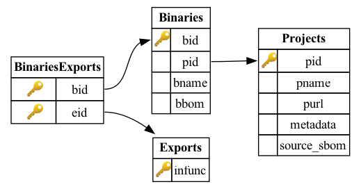

<!--
SPDX-FileCopyrightText: AppThreat <cloud@appthreat.com>

SPDX-License-Identifier: MIT
-->

# blint-db

blint-db is a family of binary symbol databases (pre-compiled SQLite files) generated by building a [collection](./docs/vcpkg-projects.csv) of [open-source](./docs/meson-projects.csv) libraries and applications across various platforms and architectures, then generating an SBOM with OWASP [blint](https://github.com/owasp-dep-scan/blint). We started this project with C/C++ projects that can be built using [wrapdb](https://github.com/mesonbuild/wrapdb) and [vcpkg](https://github.com/microsoft/vcpkg) package managers, but we plan to extend to other ecosystems.

## Use cases

Use blint-db to:

- Improve the precision of generated SBOMs and SCA for C/C++ projects
- Vectorize data to train ML models for component identification and risk prediction from binaries
- And much more

## Build pipeline

Native binaries vary based on several factors, such as configuration, build tools, and the operating system’s architecture. The project aims to generate and publish multiple versions of the [database](https://github.com/orgs/AppThreat/packages?repo_name=blint-db), [built](https://github.com/AppThreat/blint-db/blob/21a16bf87a62a137405901c37955d95883388201/blint_db/handlers/language_handlers/meson_handler.py#L40) in both debug and stripped modes [without](https://github.com/AppThreat/blint-db/blob/21a16bf87a62a137405901c37955d95883388201/blint_db/handlers/language_handlers/vcpkg_handler.py#L89) optimizations. The following OS and architecture matrix is currently available:

- Ubuntu 24.04 — amd64, arm64
- macOS 15 — arm64

## Database Schema

The schema design is not currently stable and is likely to change as we add more build pipelines.



### Table: Exports

Index of all exported symbols.

```sql
CREATE TABLE Exports ( infunc VARCHAR(4096) PRIMARY KEY )
```

### Table: Projects

Contains information about the projects indexed in the database, including each project's name, purl, and additional metadata.

`source_sbom` is currently unused.

```sql
CREATE TABLE Projects ( pid INTEGER PRIMARY KEY AUTOINCREMENT, pname VARCHAR(255) UNIQUE, purl TEXT UNIQUE, metadata BLOB, source_sbom BLOB )
```

### Table: Binaries

A given project can produce multiple binary files during the build process. This table maps each generated binary to its parent project.

`bbom` is currently unused.

```sql
CREATE TABLE Binaries ( bid INTEGER PRIMARY KEY AUTOINCREMENT, pid INTEGER, bname VARCHAR(500), bbom BLOB, FOREIGN KEY (pid) REFERENCES Projects(pid) )
```

### Table: BinariesExports

This table maps exported symbols to individual binaries.

```sql
CREATE TABLE BinariesExports ( bid INTEGER, eid INTEGER, PRIMARY KEY (bid, eid), FOREIGN KEY (bid) REFERENCES Binaries(bid), FOREIGN KEY (eid) REFERENCES Exports(eid) )
```

### Search by symbol

Given a list of symbols, use the query below to identify the matching binary IDs and export IDs.

```sql
SELECT eid, group_concat(bid) from BinariesExports where eid IN (SELECT rowid from Exports where infunc IN ({symbols_list})) group by eid
```

You can then use the binary ID to retrieve the parent project’s name and purl at any time.

```sql
SELECT bname, pname, purl from Binaries JOIN Projects on Binaries.pid = Projects.pid WHERE Binaries.bid = ?
```

Apply heuristics, such as a ranking algorithm based on the number and type of matches, to reduce false positives in the results.

## Funding

This project is funded through [NGI Zero Core](https://nlnet.nl/core), a fund established by [NLnet](https://nlnet.nl) with financial support from the European Commission's [Next Generation Internet](https://ngi.eu) program. Learn more at the [NLnet project page](https://nlnet.nl/project/OWASP-dep-scan).

[](https://nlnet.nl)  
[](https://nlnet.nl/core)
